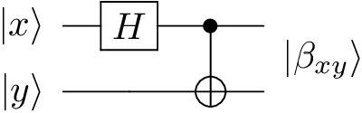

Producing Bell States
=================

The Bell states are two-qubit representations of quantum entanglement. In this state, measuring state of one qubit will instantly tell us the state of the other.

  

The Bell states are produced by passing one qubit through a Hadamard gate,  which then becomes the control qubit for a CNOT gate.

  
For example, if initially we have \|x⟩  = \|0⟩  and \|y⟩  = \|0⟩ . Passing \|x⟩  through a Hadamard gate will create the quantum superposition:

  
:math: `\|x⟩ = \frac{1}{\sqrt{2}} (|0⟩ + |1⟩)`
:math: `\|y⟩ = |0⟩`

The entire system will be in the state:  
  
:math:`|\beta_{00}⟩ = \frac{1}{\sqrt{2}} (|00⟩ + |10⟩)`.

The CNOT gate will switch the value of \|y⟩ if and only if \|x⟩ = \|1⟩. So now the system is in the state:  
  
:math:`|\beta_{00}⟩ = \frac{1}{\sqrt{2}} (|00⟩ + |11⟩)`.
 
In this state, when \|x⟩ is observed to equal \|0⟩, y will also equal \|0⟩. If \|x⟩ is observed to equal \|1⟩, y will also equal \|1⟩.

 ----- 

The Bell states can be created for all four possible intial values of \|xy⟩ = \|00⟩, \|01⟩, \|10⟩,\|11⟩.

:math:`|\beta_{00}⟩ = \frac{1}{\sqrt{2}} (|00⟩ + |11⟩)`
:math:`|\beta_{10}⟩ = \frac{1}{\sqrt{2}} (|00⟩ - |11⟩)`
:math:`|\beta_{01}⟩ = \frac{1}{\sqrt{2}} (|01⟩ + |10⟩)`
:math:`|\beta_{11}⟩ = \frac{1}{\sqrt{2}} (|01⟩ - |10⟩)`

  

Example code producing each of the four entangled Bell states for a two-qubit system:

where \|x⟩ and \|y⟩ are each one of the computational basis states, \|0⟩ or \|1⟩.

**Code**:

.. literalinclude:: ../../examples/produce_bell_states.py
