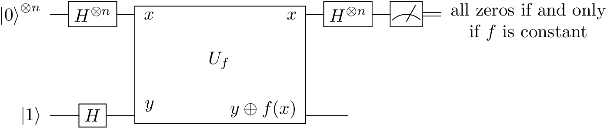

The Deutsch-Jozsa Algorithm
===========================

The Deutch-Jozsa Algorithm is a generalization of * :ref:`Deutsch's Algorithm<DeutschsAlgorithm_page>` for any given number of binary inputs, n. 

Initially we have n-qubits in the state |0⟩ and one in the state |1⟩. 

    

Applying the Hadamard gate to all qubits in the system gives:

:math: \sum_x=(0,1)^n \frac{|x⟩}{\sqrt{2^n}} \frac{1}{\sqrt{2}} (|0⟩ - |1⟩) 

Now, passing through the oracle,

:math: U_f (x,y) = (x, y ⊕ f(x))

gives, 

**Code**:

.. literalinclude:: ../../examples/deutsch_jozsa_algorithm.py
